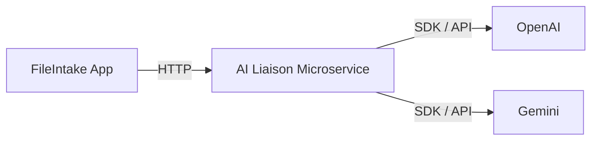

# 🤖 AI Liaison Microservice

A dedicated Python service built to act as an intermediary between the core `FileIntake` application and various external AI providers (e.g., Gemini, OpenAI, etc.). This architecture centralizes API key management, isolates the main application from third-party dependencies, and allows for easy swapping of AI models.

## 🚀 Features

* **Centralized AI Access:** Single HTTP endpoint for all AI interaction logic.

* **Security:** Uses environment variables (`GENERIC_AI_API_KEY`) to securely manage provider API keys.

* **Decoupling:** Protects the main `FileIntake` application from changes in AI SDKs or API versions.

* **Provider Agnostic:** Designed with a placeholder function (`call_ai_api`) that can be easily updated to communicate with any LLM platform.

## 🚀 CI/CD & Deployment

This service is fully automated using GitHub Actions and Google Cloud:

- **CI**:  
  - Runs on every pull request  
  - Executes unit tests with coverage  
  - Coverage reported to Codecov  

- **CD**:  
  - Triggered on merge to `master`  
  - Builds a Docker image  
  - Pushes to Google Artifact Registry  
  - Deploys to Google Cloud Run  

- **Security**:  
  - Uses **Workload Identity Federation (OIDC)**  
  - No long-lived service account keys  
  - Least-privilege IAM permissions  

This pipeline ensures all changes are tested, reviewed, and safely deployed to production.

## 🧱 Architecture

┌────────────┐         ┌──────────────────────────┐
│ FileIntake │  HTTP   │ AI Liaison Microservice  │
│ (Main App) ├───────▶│  (FastAPI / Cloud Run)    │
└────────────┘         └─────────────┬────────────┘
                                     │
                                     │ Provider SDKs
                                     ▼
                          ┌────────────────────────┐
                          │ External AI Providers   │
                          │ (OpenAI / Gemini / etc) │
                          └────────────────────────┘

The AI Liaison Microservice acts as a boundary between the core application and external AI providers, centralizing authentication, request shaping, and provider-specific logic.

## Notes

Creating this simply python project using FastAPI, nothing fancy just the things needed for now. I  have an api endpoint for 'summarize', a simple request and response model and a service that does the communication with whichever AI (currently OpenAI) I have configured.

Will be using a hardcoded message until I have my FileIntake project properly connected to this service, then I will give it API access.